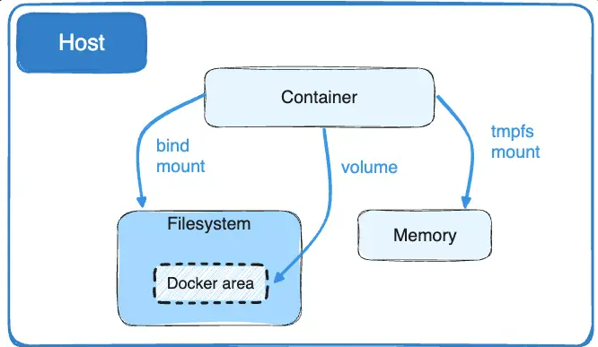

# Week 15.4

In this short offline video, Harkirat explains the concept of `Bind Mounts` in Docker and demonstrates their importance in containerizing a Next.js application. He shows how Bind Mounts enable `real-time synchronization` between the `host machine and the container`, facilitating seamless development with `hot reloading`

# **Introducing Bind Mounts**

Bind Mounts are a type of volume in Docker that allows you to bind a directory or file from the host machine to a directory or file inside a Docker container. This means that any changes made to the files or directories on the host machine will be immediately reflected inside the container, and vice versa.



Bind Mounts are particularly useful when you want to share code or configuration files between the host machine and the container, enabling you to develop and test your application in real-time without the need to rebuild the container every time you make changes.

# **Creating a Next.js Application**

To understand the importance and requirement of Bind Mounts, let's create a fresh Next.js application and see how we can use Docker to run the application with hot reloading.

1. Create a new directory for your Next.js application and navigate to it:
    
    ```bash
    mkdir nextapp
    cd nextapp
    ```
    

1. Initialize a new Next.js project:
    
    ```bash
    npx create-next-app .
    
    ```
    

1. Create a Dockerfile in the project root directory with the following content:
    
    ```bash
    FROM node:21
    
    WORKDIR /nextapp
    
    COPY package* .
    
    RUN npm install
    
    COPY . .
    
    CMD ["npm", "run", "dev"]
    ```
    
    This Dockerfile sets up the environment for running the Next.js application inside a Docker container. It starts with the Node.js base image, sets the working directory to `/nextapp`, copies the `package.json` and `package-lock.json` files, installs the dependencies, copies the rest of the application code, and finally runs the `npm run dev` command to start the development server.
    
2. Build the Docker image:
    
    ```bash
    docker build -t nextapp .
    ```
    
    This command builds the Docker image based on the Dockerfile and tags it as `nextapp`.
    
3. Run the Docker container:
    
    ```bash
    docker run -p 3000:3000 nextapp
    ```
    
    This command starts a new container based on the `nextapp` image and maps the container's port 3000 to the host machine's port 3000. This allows you to access the Next.js application running inside the container by visiting `http://localhost:3000` in your web browser.
    

# **Problem: Hot Reloading Not Working**

At this point, you may notice that hot reloading is not working. When you make changes to your application code in your IDE (e.g., VS Code), those changes are not automatically reflected in the running application inside the container.

This is because the application code inside the container is isolated from the host machine's filesystem. The container has its own filesystem, and changes made on the host machine are not automatically synced with the container.


# **Solution: Using Bind Mounts**

To enable hot reloading and synchronize changes between the host machine and the container, we can use Bind Mounts. Bind Mounts allow us to map a directory from the host machine to a directory inside the container.

1. Stop the running container:
    
    ```bash
    docker stop <container-id>
    ```
    
2. Run the container with a Bind Mount:
    
    ```bash
    docker run -p 3000:3000 -v ./app:/nextapp/app nextapp
    ```
    
    In this command, we add the `-v` flag followed by `./app:/nextapp/app`. This maps the `app` directory from the host machine to the `/nextapp/app` directory inside the container.
    
    Now, any changes made to the files in the `app` directory on the host machine will be immediately reflected inside the container, and vice versa.
    
3. Access the application:
Open your web browser and visit `http://localhost:3000`. You should see your Next.js application running.
    
    Now, if you make changes to your application code in your IDE, those changes will be automatically synced with the container, and hot reloading will work as expected.
    

Bind Mounts in Docker provide a powerful way to share files and directories between the host machine and containers. They are particularly useful for development scenarios where you want to enable hot reloading and synchronize changes in real-time.

> By using Bind Mounts, you can map directories from the host machine to directories inside the container, allowing you to develop and test your application without the need to rebuild the container every time you make changes.
>